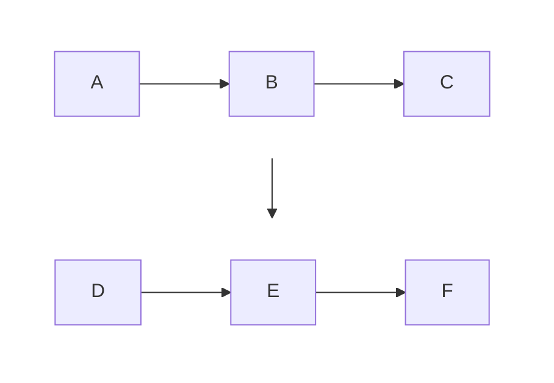
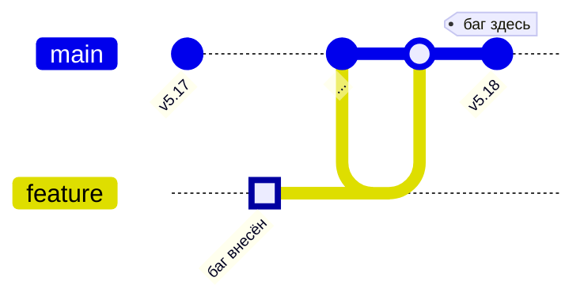

# Руководство по Mermaid-диаграммам для слайдов

## Контекст

Диаграммы рендерятся в SVG через `mmdc` (Mermaid CLI) и вставляются в Marp-слайды как фоновые изображения. Слайды 1280x720, тёмный фон `#1a1a2e`. Диаграммы должны быть крупными и читаемыми с последнего ряда зала.

## Главный приём: progressive reveal

Серия из N слайдов показывает одну и ту же диаграмму, но на каждом слайде "загорается" следующий элемент. Зритель видит всю структуру с первого кадра (серые призраки), а фокус переключается цветом.

### Требования к серии диаграмм

**Текст идентичен во всех файлах серии.** Ни один символ текста в узлах и подписях не должен меняться между файлами. Иначе Mermaid перестроит layout и элементы сдвинутся.

**Структура (узлы, связи, subgraph) идентична.** Меняются ТОЛЬКО:
- classDef-назначения узлов (:::done, :::active, :::pending, :::error, :::success)
- linkStyle цвета и толщина стрелок

**Проверка:** `grep -oE '\["[^"]+"\]' file-1.mmd` должен давать одинаковый результат для всех файлов серии.

## Паттерн: flowchart TB + subgraph LR

Слайды горизонтальные (16:9). Одна линия узлов слишком длинная. Решение — два ряда:



- `flowchart TB` — ряды идут сверху вниз
- `direction LR` внутри subgraph — узлы в ряду идут слева направо
- `style S1/S2 fill:transparent,stroke:transparent` — рамки subgraph невидимы
- `S1 --> S2` — стрелка-связь между рядами

3-4 узла на ряд. Максимум 2-3 ряда.

## 5 состояний узлов (classDef)

```mermaid
classDef done fill:#2a2a4e,stroke:#FFD02F,color:#eee
classDef active fill:#3a2a1e,stroke:#FFD02F,color:#FFD02F
classDef pending fill:#1e1e30,stroke:#444,color:#666
classDef error fill:#4e2a2a,stroke:#ff4444,color:#eee
classDef success fill:#2a4e2a,stroke:#44ff88,color:#eee
```

| classDef | Фон | Рамка | Текст | Когда |
|----------|-----|-------|-------|-------|
| `pending` | почти чёрный | серая | серый | Ещё не обсуждали. Виден как "призрак" |
| `active` | тёплый | жёлтая толстая | жёлтый | **Сейчас обсуждаем** |
| `done` | синий | жёлтая | белый | Уже обсудили |
| `error` | тёмно-красный | красная | белый | Проблема, сбой |
| `success` | тёмно-зелёный | зелёная | белый | Решение, успех |

## linkStyle для стрелок

Стрелки стилизуются по индексу (порядку появления в файле):

**Толщина всегда 2px.** Разная толщина сдвигает layout между слайдами серии.

| Состояние | linkStyle |
|-----------|-----------|
| pending | `stroke:#444,stroke-width:2px` |
| active | `stroke:#FFD02F,stroke-width:2px` |
| done | `stroke:#FFD02F,stroke-width:2px` |
| error | `stroke:#ff4444,stroke-width:2px` |
| success | `stroke:#44ff88,stroke-width:2px` |

## Init-блок (обязателен)

```
%%{init: {'theme': 'dark', 'themeVariables': {
    'primaryColor': '#1a1a2e',
    'primaryTextColor': '#eee',
    'lineColor': '#FFD02F'
}, 'flowchart': {
    'nodeSpacing': 25,
    'rankSpacing': 20
}}}%%
```

- `theme: dark` — тёмный фон
- `nodeSpacing: 25` и `rankSpacing: 20` — компактная раскладка
- Цвета совпадают с темой слайдов `heisenbug.css`

## Текст узлов

- **Короткий.** 1-2 слова. Максимум 3.
- **Без переносов.** Не использовать `<br/>` — это меняет высоту узла.
- **Без подписей на стрелках.** Стрелки чистые. Пояснения — в speaker notes.
- **Финальный текст с первого слайда.** Даже pending-узлы содержат итоговый текст, просто он серый.

---

## Тип 2: gitGraph — для визуализации истории коммитов

Для раздела про git bisect и root cause. Показывает ветки, мержи, конкретные коммиты.

### Синтаксис



### Ключевые возможности

| Возможность | Синтаксис | Применение у нас |
|-------------|-----------|-----------------|
| Метка коммита | `commit id: "текст"` | Показать v5.17, v5.18, v6.9 |
| Тег (релиз) | `commit tag: "v5.18"` | Отметить версии ядра |
| Выделение | `commit type: HIGHLIGHT` | Коммит-виновник, коммит-фикс |
| Пометка "плохой" | `commit type: REVERSE` | Проблемный коммит (крестик) |
| Ветка | `branch feature` | Ветка подсистемы памяти |
| Мерж | `merge feature` | Слияние в mainline |
| Cherry-pick | `cherry-pick id: "..."` | Бэкпорт (или его отсутствие) |
| Направление | `gitGraph LR:` / `gitGraph TB:` | LR для горизонтального слайда |

### Стилизация через тему

```
%%{init: { 'theme': 'dark', 'themeVariables': {
    'git0': '#FFD02F',
    'git1': '#ff4444',
    'git2': '#44ff88',
    'gitBranchLabel0': '#eee',
    'gitBranchLabel1': '#eee',
    'commitLabelColor': '#eee',
    'commitLabelBackground': '#2a2a4e',
    'tagLabelColor': '#eee',
    'tagLabelBackground': '#4e2a2a',
    'tagLabelBorder': '#ff4444'
}}}%%
```

- Цвета веток: `git0`..`git7` (до 8 веток, потом циклятся)
- `commitLabelColor/Background` — подписи коммитов
- `tagLabelColor/Background/Border` — теги версий

### Применение в нашем докладе

**Слайд "Git bisect":** Показать граф ядра с ветками подсистем, мерж-коммитами, и выделить коммит-виновник.

**Слайд "Один человек, два коммита":** Показать timeline: v5.17 (good) → коммит 56a4d67 (HIGHLIGHT) → v5.18 (bad) → ... → v6.9 (fix, tag).

### Ограничения gitGraph

- **Нет classDef** — нельзя стилизовать индивидуальные коммиты цветом
- **Нет linkStyle** — нельзя стилизовать отдельные стрелки
- **Нет progressive reveal** — все коммиты рисуются сразу
- **Стилизация только через тему** — глобально, не поштучно
- Подходит для **статичных** слайдов, не для диафильмов

### Когда использовать gitGraph, а когда flowchart

| Задача | Инструмент |
|--------|-----------|
| Progressive reveal (диафильм) | **flowchart** |
| История коммитов с ветками | **gitGraph** |
| Схема процесса/механизма | **flowchart** |
| Timeline версий ядра | **gitGraph** |
| Визуализация race condition | **flowchart** |
| Что делал git bisect | **gitGraph** |

---

## Тип 3: timeline — прогресс-бар истории

Timeline-диаграмма как визуальное оглавление доклада. Появляется в начале каждого раздела, постепенно дополняясь. Зритель видит, где он в истории и что впереди.

### Синтаксис

```
timeline
    title Расследование
    section Начало
        30 декабря : Postgres падает
        31 декабря : Безумная гипотеза
        7 января : Пинг-понг
    section Расследование
        Логи : Нули в dmesg
        Гипотезы : Не железо, не Postgres
        Воскрешение : Падение без падения
    section Три условия
        XFS : Только эта ФС
        init_on_free : ФСТЭК, безопасность
        Memory pressure : Под нагрузкой
    section Доказательство
        30 секунд : Воспроизведение
        git bisect : Коммит найден
    section Root cause
        Март 2022 : Коммит-виновник
        Race condition : Два CPU
        Ядро 6.9 : Случайный фикс
```

### Применение: progressive timeline

На каждом разделе доклада показываем timeline, но с разным количеством секций.

| Раздел доклада | Что на timeline | Секции |
|----------------|----------------|--------|
| Р2 Завязка | Только "Начало" | 1 |
| Р4 Зацепки | + "Расследование" | 2 |
| Р5 Условия | + "Три условия" | 3 |
| Р6-7 Bisect | + "Доказательство" | 4 |
| Р8 Root cause | + "Root cause" (полная) | 5 |

### Стилизация через тему

```
%%{init: { 'theme': 'dark', 'themeVariables': {
    'cScale0': '#2a2a4e',
    'cScale1': '#3a2a1e',
    'cScale2': '#4e2a2a',
    'cScale3': '#2a4e2a',
    'cScale4': '#4e2a4e',
    'cScaleLabel0': '#eee',
    'cScaleLabel1': '#FFD02F',
    'cScaleLabel2': '#ff4444',
    'cScaleLabel3': '#44ff88',
    'cScaleLabel4': '#eee'
}}}%%
```

- `cScale0`..`cScale11` — фон секций (до 12 цветов)
- `cScaleLabel0`..`cScaleLabel11` — цвет текста секций
- `disableMulticolor: false` — каждая секция своим цветом (по умолчанию)

### Progressive reveal для timeline

Timeline не поддерживает classDef, но progressive reveal можно сделать через **секции с цветами темы**:

- Пройденные секции → яркие цвета (`cScale0`: `#2a2a4e`)
- Текущая секция → акцентный цвет (`cScale1`: `#3a2a1e`)
- Будущие секции → **не рисуются** (просто не включаются в файл)

В отличие от flowchart, где мы делаем "призраки", в timeline проще: **каждый файл серии содержит только секции до текущего момента.** Это работает, потому что timeline не имеет фиксированного layout — новые секции просто добавляются справа.

```
# timeline-1.mmd (для Р2):
timeline
    section Начало
        30 декабря : Postgres падает

# timeline-3.mmd (для Р5):
timeline
    section Начало
        30 декабря : Postgres падает
    section Расследование
        Логи : Нули в dmesg
    section Три условия
        XFS : Только эта ФС
```

### Ограничения

- **Нет classDef** — нельзя стилизовать отдельные события
- **Нет linkStyle** — нет стрелок
- Стилизация только через **тему** (глобально по секциям)
- **Experimental** — синтаксис может измениться
- Progressive reveal через **добавление секций**, а не через цвета элементов

### Когда использовать

| Задача | Инструмент |
|--------|-----------|
| Progressive reveal механизма | **flowchart** |
| История коммитов | **gitGraph** |
| Хронология расследования / навигация по докладу | **timeline** |

---

## Вставка в slides.md

```markdown

```

`bg contain` — растянуть SVG на весь слайд с сохранением пропорций.

## Сборка

```bash
./build.sh diagrams    # только диаграммы
./build.sh             # диаграммы + слайды + watch
```

Pipeline: `diagrams/*.mmd` --mmdc--> `img/*.svg` --marp--> `slides.html`

Инкрементальная: пересобирается только если .mmd новее .svg.

---

## Как делать НЕ надо

### Не менять текст между слайдами серии
```
# ПЛОХО: текст разный → layout плывёт
resurrection-1.mmd: M["Память: код postgres"]
resurrection-2.mmd: M["Память: ПУСТО"]
resurrection-3.mmd: M["Память: 00 00 00 00"]
```
Mermaid пересчитывает ширину узла под текст. Элементы сдвигаются. Иллюзия анимации разрушается.

### Не использовать sequence diagram для progressive reveal
Sequence diagram не поддерживает `style` для отдельных элементов и `linkStyle` для стрелок. Невозможно сделать элементы "невидимыми".

### Не делать длинные горизонтальные цепочки в flowchart LR
```
# ПЛОХО: 7 узлов в одну линию → мелко на слайде
flowchart LR
    A --> B --> C --> D --> E --> F --> G
```
Ширина SVG 1200+px, высота 100px. На слайде 1280x720 диаграмма будет узкой полоской.

### Не использовать flowchart LR с subgraph direction LR для переноса
```
# ПЛОХО: вложенный direction LR внутри flowchart LR игнорируется
flowchart LR
    subgraph S1 [" "]
        direction LR    <-- Mermaid игнорирует это
        A --> B --> C
    end
```
Mermaid не поддерживает переопределение direction в subgraph того же направления. Всё вытягивается в одну линию.

### Не ставить подписи на стрелки
```
# ПЛОХО: подписи занимают место и нестабильны
A -->|"mmap: отображение файла в память"| B
```
Длинные подписи раздвигают узлы. Разные подписи = разный layout. Пояснения — только в speaker notes.

### Не менять stroke-width между слайдами серии
```
# ПЛОХО: active 3px, pending 1px → layout сдвигается
classDef active fill:...,stroke-width:3px
classDef pending fill:...,stroke-width:1px
```
Mermaid учитывает толщину рамки при расчёте размеров узлов. Разная толщина = разные размеры = сдвиг. Все classDef и linkStyle должны использовать одинаковый `stroke-width:2px`.

### Не забывать прозрачные рамки subgraph
```
# ПЛОХО: видна серая рамка вокруг группы
subgraph S1 ["Верхний ряд"]
```
Рамка и заголовок subgraph видны по умолчанию. Нужно:
```
style S1 fill:transparent,stroke:transparent
```
И пустой заголовок: `subgraph S1 [" "]`
