<!-- _class: lead -->
<!-- _paginate: false -->

# Системные баги под нагрузкой

## Михаил Жилин, Postgres Professional

### Heisenbug 2026

<!--
Всем привет! Меня зовут Михаил Жилин, работаю в Postgres Professional, больше пятнадцати лет занимаюсь тем, что нагружаю системы и смотрю, что при этом ломается.
Вот, и сегодня у меня для вас история.
-->

---

<!-- ====== РАЗДЕЛ 1. Вступление (3 мин) ====== -->

# Инструкции стёрты из памяти

```
postgres[24237]: segfault at cb1 ip 00005579a1505130
Code: 00 00 00 00 00 00 00 00 00 00 00 00 00 00 00 00
```

<!--
Но сначала — посмотрите на этот слайд. Это реальный вывод из системного журнала одного из наших серверов.
Видите поле Code? Там, где должны быть инструкции процессора — нули. Одни нули.
-->

---


# Инструкции стёрты из памяти

```
postgres[24237]: segfault at cb1 ip 00005579a1505130
Code: 00 00 00 00 00 00 00 00 00 00 00 00 00 00 00 00
```


<!--
Как будто кто-то взял и стёр код прямо из памяти.
-->

---

# Не Postgres. Не железо. Глубже.

- Не баг в Postgres — проверили
- Не проблема с железом — тоже проверили
- Что-то на уровне, куда мы обычно не заглядываем

<!--
Мы увидели это и, скажем так, немножко напряглись. Потому что это не похоже ни на что знакомое. 
-->


---

# **Не Postgres**. Не железо. Глубже.

- **Не баг в Postgres — проверили**
- Не проблема с железом — тоже проверили
- Что-то на уровне, куда мы обычно не заглядываем


<!--
Это не баг в Postgres — мы проверили
-->


---

# Не Postgres. **Не железо**. Глубже.

- Не баг в Postgres — проверили
- **Не проблема с железом — тоже проверили**
- Что-то на уровне, куда мы обычно не заглядываем

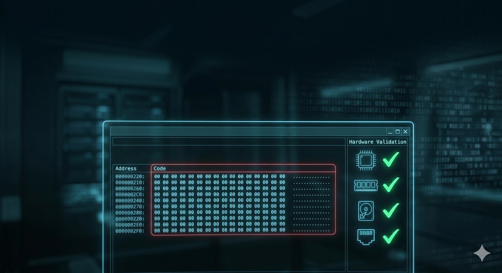


<!--
Это не проблема с железом — тоже проверили. 
-->


---

# Не Postgres. Не железо. **Глубже**.

- Не баг в Postgres — проверили
- Не проблема с железом — тоже проверили
- **Что-то на уровне, куда мы обычно не заглядываем**


<!--
Что-то на уровне, куда мы обычно не заглядываем.
-->


---

# Параметр безопасности уничтожал код

- **Несколько строчек** в ядре Linux ломали серверы **2 года**

<!--
Расследование заняло у нас год. И когда мы наконец нашли причину — оказалось, что несколько строчек кода в ядре Linux ломали серверы два года подряд.
-->


---

# Параметр безопасности **уничтожал** код

- **Несколько строчек** в ядре Linux ломали серверы **2 года**
- Параметр для **защиты данных** — обнулял код в памяти


<!--
И, что самое любопытное, параметр, который создан для защиты данных — он-то и уничтожал код в памяти.
Вот об этом расследовании сегодня и поговорим. Шаг за шагом — как мы искали, на что наступали и куда в итоге пришли.
-->

---

<!-- ====== РАЗДЕЛ 2. Завязка (4 мин) ====== -->

# 30 декабря: салатики подождут


<!--
Началось всё 30 декабря. Когда нормальные люди уже шинкуют салатики. На одном из серверов у клиента упал Postgres с сегфолтом. Ну, бывает, подняли. А потом упал ещё раз. И ещё. И не только у этого клиента — через какое-то время похожие обращения стали приходить от других. «Оно работало, потом упало, мы подняли, оно опять упало. Что это было?»
Первая реакция — ну наверное что-то не так настроено. Не тот параметр, не та версия. Стандартная история, правда? Но тут ситуация другая.
-->

---

# 2 часа ночи 31 декабря: ОС подменяет инструкции

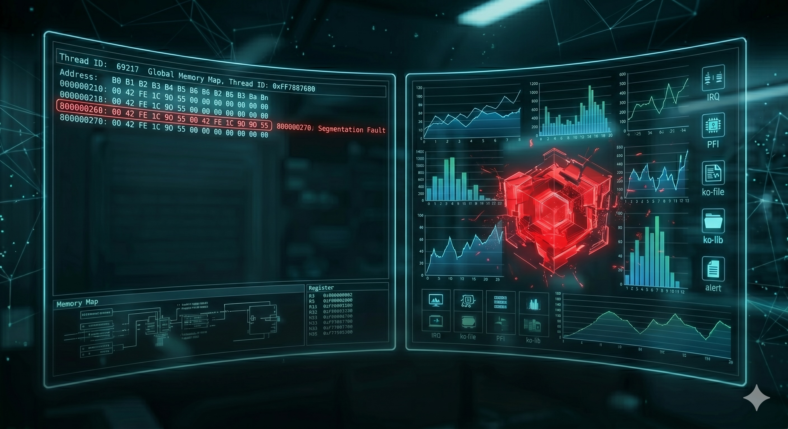


<!--
В 2 часа ночи 31 декабря, когда нормальным людям уже точно не до серверов, появилась первая безумная гипотеза: операционная система подменяет инструкции прямо в памяти. Звучит как бред? Нам тоже так казалось.
-->

---

# «Не наш баг» — заказчик не согласен


<!--
Мы составили отчёт и послали заказчику: мол, проблема не на нашей стороне. А заказчику не очень-то понравилось. И 7 января, на Рождество, к 9 утра представители нескольких компаний собрались на общую встречу — устроили рождественский пинг-понг. Мы объяснили свою техническую позицию — наши кони побили все ихние пешки. Но заказчику от этого не легче — у него Postgres падает.
-->

---

# Плавающий баг: рандомное время, рандомное место

- Кластеры Postgres разных версий падают с сегфолтами
- Разные ядра Linux, разное железо, разный софт
- Обращения к некорректным адресам памяти
- Всё в рандомный момент, без видимых причин
- Болели **продакшн-системы**, а не лабораторные стенды

<!--
Вот что мы имеем на входе. Смотрите. Кластеры Postgres разных версий падают с сегфолтами. Серверы с разными ядрами Linux, разное железо, разный софт. В логах — обращения к некорректным адресам памяти, попытки выполнения несуществующих инструкций. И всё это в рандомный момент времени, без видимых причин.
Классический плавающий баг. Который ни поймать, ни воспроизвести. И болели серьёзные продакшн-системы, а не лабораторные стенды.
-->

---

# Дампы указывают на всё, кроме Postgres

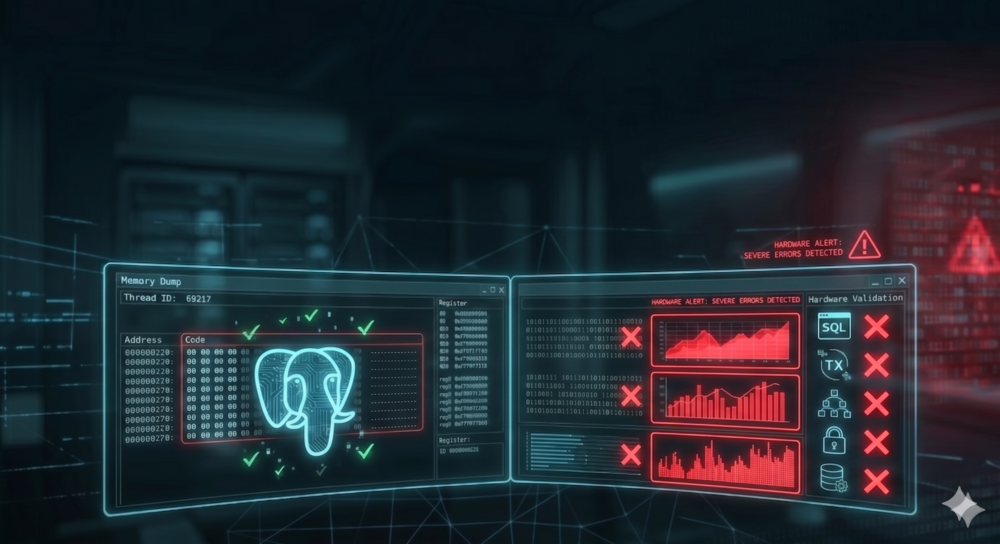


<!--
Но была одна очень важная особенность, общая для всех: анализ дампов и диагностических данных указывал на что угодно, кроме Postgres. Вот прям на что угодно. Ни разу не был виноват наш код. Ни разу.
-->

---

# Ни одна сторона не взяла проблему. Кроме нас

<!--
И вот тут можно было бы на этом и остановиться. Формально правы, отчёт отправлен. Но проблема-то странная. Ни одна из сторон не приняла её как свою — кроме нас. Потому что клиентам-то от этого не легче, что баг «не наш». Им надо, чтобы не падало. И профессиональное любопытство взяло верх.

И мы пошли копать. 
-->

---

# Ни одна сторона не взяла проблему. Кроме нас

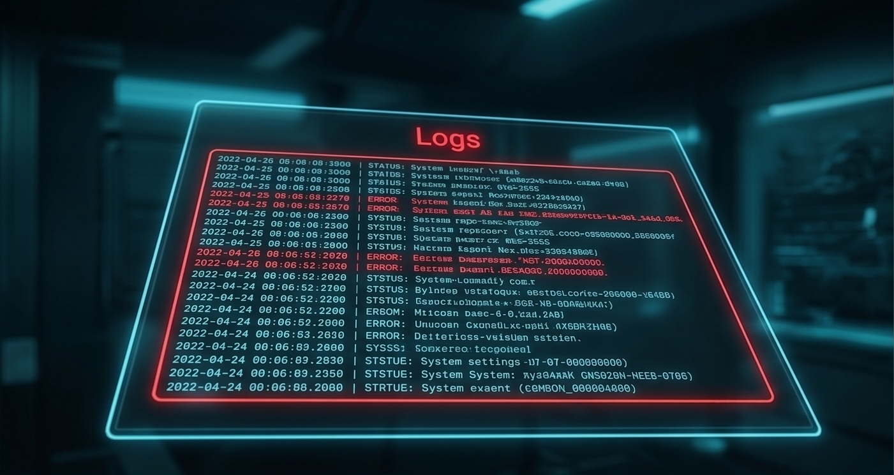

<!--
Сначала — в логи
-->

---

# Ни одна сторона не взяла проблему. Кроме нас

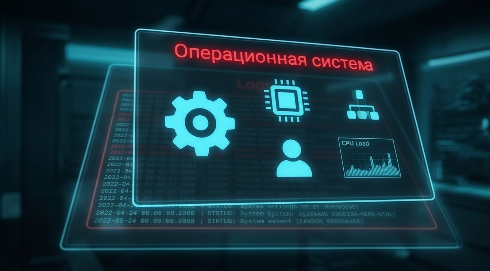

<!--
Потом — в операционную систему
-->

---

# Ни одна сторона не взяла проблему. Кроме нас


<!--
Потом — в файловую систему
-->

---

# Ни одна сторона не взяла проблему. Кроме нас

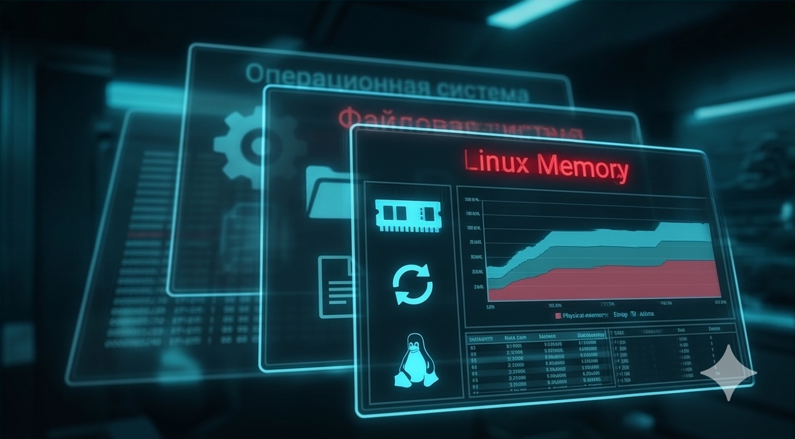

<!--
Потом — в подсистему памяти ядра Linux. 

С каждым уровнем становилось всё интереснее. И всё страшнее.
-->

---

<!-- Навигация: где мы сейчас -->

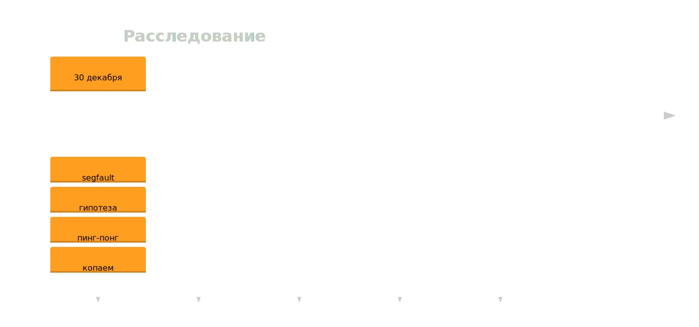

<!--
Мы прошли первый этап — завязку. 30 декабря, безумная гипотеза, рождественский пинг-понг. Теперь начинаем копать.
-->

---

<!-- ====== РАЗДЕЛ 3. Уровни стека (3 мин) ====== -->

# Шесть уровней: от приложения до железа

* Приложение
* База данных (PostgreSQL)
* Операционная система (Linux)
* Файловая система (XFS)
* Подсистема памяти (mmap, page cache)
* Железо

<!--
Вот на слайде — стек уровней, через которые мы в итоге прошли. Приложение, база данных, операционная система, файловая система, подсистема памяти, железо. Мы начали сверху и за год добрались до самого низа. Но в тот момент мы этого ещё не знали.
-->

---

# Логи приложения и базы: пусто

<!--
Первое, что мы сделали — залезли в логи Postgres. Ну логично, правда? Приложение падает — смотришь логи приложения. Ничего. Postgres пишет, что получил сегфолт — segmentation fault, это когда процесс пытается обратиться к участку памяти, который ему не принадлежит — и аварийно завершился. Почему — не знает.
В логах базы данных тоже ничего необычного.
-->

---

# dmesg: нули у всех процессов, не только Postgres

<!--
Пошли глубже — в операционную систему. И вот тут стало прям интересно. В dmesg — системном журнале Linux — мы увидели те самые нули. И не только для Postgres, а для разных процессов. То есть проблема не привязана к конкретному приложению. Она шире.
-->

---

# Только XFS. Только под давлением на память.

- На **ext4** — тишина
- Чем больше **параллелизма** — тем чаще падает
- Пахнет **гонкой данных**

<!--
Ещё глубже — файловая система. Оказалось, что проблема воспроизводится только на XFS. На ext4 — тишина. Вот это поворот.
Ещё глубже — подсистема памяти ядра. И здесь нашлась зависимость: проблема проявляется под давлением на память в несколько потоков. Чем больше параллельных процессов жрут память одновременно — тем чаще падает. А когда что-то ломается именно при параллелизме — это пахнет гонкой данных.
-->

---

# Каждый уровень вниз — новая зацепка

<!--
И вот тут важная мысль. На каждом уровне мы могли остановиться и сказать: «ну, это не наш уровень, дальше пусть разбираются другие». Но мы продолжали. И каждый следующий шаг вниз давал новую зацепку.
Это немножко как археология. Копаешь первый слой — черепки. Копаешь второй — фундамент. Копаешь третий — а там целый город. Но чтобы до него добраться, надо не бросить на черепках.
-->

---

<!-- ====== РАЗДЕЛ 4. Первые зацепки (5 мин) ====== -->

# Процессор выполняет пустоту

```
Code: 00 00 00 00 00 00 00 00 00 00 00 00 00 00 00 00
```

<!--
Ну хорошо, мы решили копать. Помните те нули из вступления? Давайте разберёмся, что мы на самом деле видели.
Мы такие открываем dmesg, смотрим в поле Code после сегфолта — и там обычно байты инструкций процессора. Что-нибудь осмысленное, реальные опкоды. А у нас — одни нули. Целые строки нулей. Блин, то есть процессор пытается выполнить код, а в том месте памяти, где этот код должен лежать — пусто. Как будто страницу вырвали из книги и вставили чистый лист.
-->

---

# Железо? Разные серверы — одна проблема.

<!--
Первая гипотеза — железо. Плохая память, битые планки. Мы такие: ну ладно, проверяем. Но проблема на серверах самых разных конфигураций. Разные производители, разная память, разные диски. Железо ни при чём.
-->

---

# Падают и другие приложения

<!--
Тогда вторая гипотеза — может, это Postgres всё-таки? Начинаем проверять. И тут нам помогло одно наблюдение: подобные ошибки обнаруживаются в логах других приложений на тех же серверах. Не только Postgres падает с нулями вместо кода. Другие приложения тоже. Просто они не столь критичны — кто-то перезапускается сам, кого-то просто никто не замечает.
Это было ключевое наблюдение. Если падает не только Postgres, значит, проблема ниже. Это ОС или ядро.
-->

---

# Больше нагрузки — кратно чаще падает

<!--
И ещё одна закономерность: чем больше нагрузка на память, тем чаще падает. Не линейно, а кратно. Это был перелом. Мы поняли направление: не Postgres, не железо, а подсистема управления памятью ядра Linux. Под нагрузкой.
Иногда в dmesg ошибка фиксировалась не как сегфолт, а как invalid opcode — попытка выполнить некорректную инструкцию. Почему некорректную? Потому что это ноль. Который попал вместо реального кода.
Картинка сложилась. Это не Postgres сломался — это память, в которой лежал код, была обнулена чем-то внутри самой операционной системы.
-->

---

<!-- Воскрешение: progressive reveal — 4 слайда с диаграммами -->

# Воскрешение: SIGSEGV



<!--
И вот тут — вишенка на торте. Мы обнаружили эффект, который внутри команды назвали «воскрешением».
Смотрите, что происходит. Процессор пытается выполнить инструкцию, а там нули. Он генерирует аппаратное прерывание — SIGSEGV, сегфолт. Управление передаётся обработчику сигналов Postgres.
-->

---

# 100 мс паузы: логгер тормозит процесс



<!--
У нас в Postgres есть такой механизм — похож на HotSpot Error Logging в Java — который при падении начинает собирать информацию: стек вызовов, состояние регистров, карту памяти. И записывает всё это в лог-файл.
Так вот, эта запись — операция не мгновенная. Она занимает порядка ста миллисекунд. И за эти сто миллисекунд происходит магия. Пока логгер «тормозит» процесс, ядро Linux в фоне успевает обновить ту самую страницу памяти — подтянуть из файловой системы реальные данные вместо нулей. Страница «прогревается».
-->

---

# Повтор инструкции: данные уже верные



<!--
А дальше — ключевой момент. Когда обработчик сигнала завершает работу, в Linux при возврате из обработчика синхронного сигнала процессор повторяет ту же самую инструкцию, на которой произошёл сбой. Но теперь-то в памяти уже лежит правильный код! И инструкция выполняется успешно. Процесс продолжает работать как ни в чём не бывало.
-->

---

# «У нас было падение, но падения не было»



<!--
К нам приходит клиент и говорит: «Ребята, у нас было падение, но падения не было. CREATE INDEX отработал до конца, индекс валидный, несмотря на сегфолт в логах». Вот попробуй такое воспроизведи.
-->

---

# Нули в данных страшнее нулей в коде

<!--
И тут важный нюанс: это «воскрешение» сработало только потому, что нули попали в область кода — инструкций. А что если бы нули попали, скажем, в метаданные эльф-файла? Мы бы не получили сегфолт, зато зачитали бы нули там, где не ожидали, — и данные начали бы корраптиться. Тихая порча без падения. Это, пожалуй, ещё страшнее.
-->

---

<!-- Навигация: где мы сейчас -->

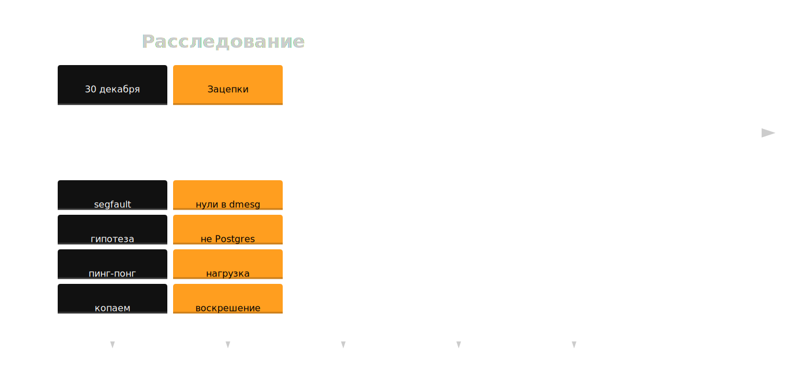

<!--
Мы прошли второй этап — нашли зацепки. Нули в dmesg, проблема не в Postgres, обнаружили воскрешение. Теперь нужно понять — какие условия вызывают баг.
-->

---

<!-- ====== РАЗДЕЛ 5. Тройка условий (6 мин) ====== -->

# Три условия одновременно. По отдельности — безобидны.

<!--
Мы копали дальше. И выяснилось, что для воспроизведения бага нужны три условия одновременно. Не два, а именно три. По отдельности всё работает прекрасно. А вот когда они складываются вместе — стреляет.
-->

---

# Условие 1: XFS — стандарт для больших баз

- Блоки до 64 КБ, параллельная работа с журналами
- В продакшне с PostgreSQL — **очень часто**
- На ext4 баг **не воспроизводится**

<!--
Проблемный файл должен лежать на XFS. Если перенести его на ext4 — баг не воспроизводится. XFS — это файловая система, которую часто выбирают для больших баз данных. Она хорошо работает с большими файлами, поддерживает блоки до 64 килобайт, умеет параллельно работать с журналами. Поэтому в продакшне с PostgreSQL она встречается очень часто. Если у вас ext4 — этот конкретный баг вас не касается. Но не потому что ext4 лучше, а просто потому что механизм другой.
-->

---

# Условие 2: init_on_free — обнуление памяти

<!--
Это параметр ядра Linux. Что он делает? Он обнуляет содержимое страниц памяти при их освобождении. То есть, когда процесс отдаёт память обратно системе, ОС заполняет эту память нулями. Зачем? Чтобы следующий процесс не мог подглядеть чужие данные.
-->

---

# Debian: выключен. Российские ОС: включён. ФСТЭК.

<!--
И вот что интересно: в Debian этот параметр по умолчанию выключен. А в российских дистрибутивах — включён. Потому что для сертификации ФСТЭК нужно обнулять память при освобождении. То есть в Debian баг не воспроизводится, а в российских дистрибутивах — воспроизводится. Подсказка на букву «Б» — безопасность.
-->

---

# Защита данных уничтожает код

```
mem auto-init: heap free:on
```

<!--
Ирония в том, что параметр, созданный для безопасности — «обнулять память» — приводит к тому, что обнуляется код. Вот те самые нули вместо инструкций — это оно.
Если хотите проверить, включён ли он у вас — ищите в логах mem auto-init: heap free:on. Вот если on — значит, включён.
-->

---

# Условие 3: давление на память + mmap

<!--
Когда памяти мало, ядро начинает освобождать страницы — это называется memory reclaim. Ну, грубо говоря, ОС ищет, что можно выгрузить из памяти, чтобы освободить место. И среди прочего она может выгрузить страницы, в которые были загружены файлы с диска.
А вот дальше — самое коварное. Когда вы запускаете любую программу — хоть Postgres, хоть ls — ОС не копирует весь файл программы в память. Она отображает его. Это называется mmap. То есть ОС говорит: «вот этот файл на диске — считай, что он уже в памяти, я подгружу нужные куски по мере обращения».
-->

---

<!-- mmap: progressive reveal — 4 слайда с диаграммами -->

# Нормальная работа: файл отображён в память



<!--
Когда вы запускаете любую программу — хоть Postgres, хоть ls — ОС не копирует весь файл программы в память. Она отображает его. Это называется mmap. Файл на XFS, отображён в память, CPU читает код — всё работает.
-->

---

# Памяти не хватает — страница выгружена



<!--
Когда памяти мало, ядро начинает освобождать страницы — это называется memory reclaim. ОС ищет, что можно выгрузить из памяти, чтобы освободить место. И среди прочего она выгружает страницу с кодом нашей программы.
-->

---

# init_on_free обнуляет страницу



<!--
А при выгрузке init_on_free обнуляет содержимое страницы. Это та самая настройка безопасности — чтобы следующий процесс не мог подглядеть чужие данные. Страница теперь заполнена нулями.
-->

---

# Гонка: страница не перечитана — нули вместо кода



<!--
И вот что происходит при баге: программа снова обращается к этому коду, ОС должна подгрузить его заново с диска — но из-за гонки данных в ядре страница не перечитывается. И программа получает нули вместо своего кода.
-->

---

<!-- Три условия: progressive reveal — 4 слайда -->

# XFS сама по себе — отличная файловая система



<!--
Почему раньше не замечали? Потому что нужны все три условия одновременно плюс нагрузка. По отдельности каждое из них абсолютно безобидно. XFS сама по себе — отличная файловая система, работает годами.
-->

---

# init_on_free — полезный параметр безопасности



<!--
init_on_free — полезный параметр безопасности. Он защищает данные. Без него Debian живёт прекрасно, с ним — российские дистрибутивы проходят сертификацию ФСТЭК.
-->

---

# Давление на память — нормальная ситуация



<!--
Давление на память — ну, это вообще нормальная ситуация для нагруженного сервера. Ничего страшного, ядро справляется. Обычно.
-->

---

# Три безобидных вещи вместе — баг



<!--
Но когда все три фактора встречаются вместе — вот в пересечении и живёт баг. Вот поэтому «Системные баги под нагрузкой» — это не баг в одном компоненте. Это баг на стыке, который без нагрузки просто не существует. Именно поэтому его так сложно было поймать.
-->

---

# Лечилка: мягкий ретрай вместо фатальной ошибки

<!--
И вот тут, понимая весь этот механизм, мы вернулись к тому «забавному эффекту» — падение происходит, но Postgres выживает. И поняли: пауза во время записи лога даёт ядру время «прийти в себя» и подтянуть данные. Наш обработчик сигналов при SIGSEGV делает ровно то, что нужно — даёт системе фору. Он не убивает процесс, а возвращает управление. И процессор повторяет ту же инструкцию — а там уже верные данные.
Мы написали лечилку — патч на Postgres, который превращает фатальную ошибку в мягкий ретрай. Это помогало не всегда — только когда нули попадали именно в код. Но когда помогало — реально спасало продакшн. Клиенты получали патч на базу данных и могли продолжить работу, не дожидаясь обновления ядра. Вот это и есть «сделать чёрный ящик белым» — поняв логику ядра, мы смогли с ней работать.
-->

---

# Лечилка — workaround. Нужен root cause.

<!--
Но лечилка — это workaround. Нам нужно было доказать, что баг существует, и найти его корень. А для этого — воспроизвести.
-->

---

<!-- Навигация: где мы сейчас -->

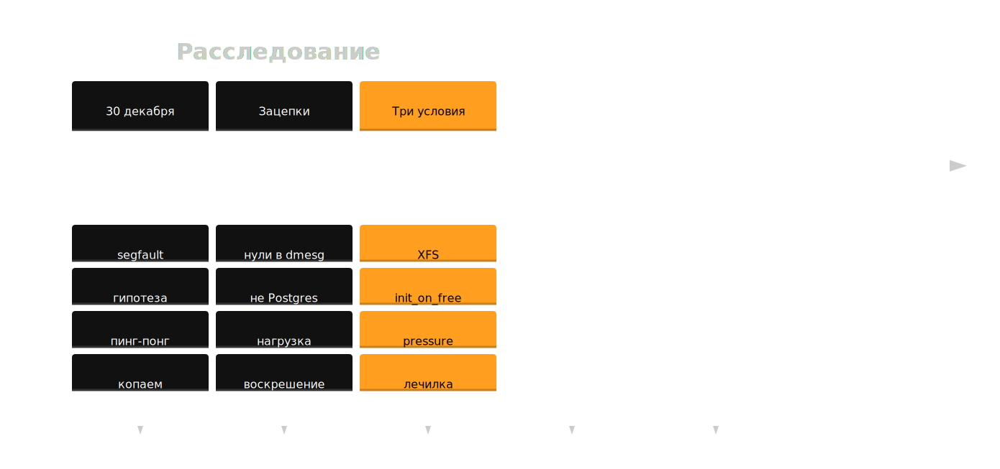

<!--
Мы прошли третий этап — нашли три условия и написали лечилку. Теперь нужно воспроизвести, найти точный коммит и добраться до root cause.
-->

---

<!-- ====== РАЗДЕЛ 6. Воспроизведение (5 мин) ====== -->

# От раза в неделю до 30 секунд

<!--
Надо воспроизвести. Потому что без воспроизведения мы просто ребята с теорией. И вот тут нам удалось сделать то, чем я прям горжусь: мы сократили время воспроизведения с одного раза в неделю до тридцати секунд. Это было ключевым — потому что без быстрого воспроизведения нельзя было запустить git bisect по ядру.
-->

---

# Стенд: обычная виртуалочка за 5 минут

- Debian 11/12, **4 CPU**, **4 GB** RAM, 20 GB диск
- `init_on_free=1`, `transparent_hugepage=never`

```bash
dd if=/dev/zero of=xfs.file bs=1M count=384
mkfs.xfs -f xfs.file
mount -t xfs xfs.file xfs.mnt
```

<!--
Стенд — ничего особенного. Debian 11 или 12, четыре процессора, четыре гига оперативки, двадцать гигабайт на диске. Обычная виртуалочка, которую можно поднять за пять минут. Системный раздел на ext4. Ну и в загрузчике добавляем два параметра: init_on_free=1 и transparent_hugepage=never — чтобы исключить влияние THP.
Для теста монтируем XFS размером 384 мегабайта прямо поверх файла на системном разделе. Простенько, правда? Никакого специального железа, никаких особых требований.
-->

---

# Тест 1: порча данных — единицы стали нулями

```c
for (;;) {
  if (malloc(1024) == NULL) return 1;
}
```

**Got invalid value on page 42 = 0**

<!--
Теперь воспроизводим двумя путями.
Путь первый — порча данных. Берём файлик, кладём его на XFS, заполняем единицами. Сто блоков по четыре килобайта. Отображаем в память через mmap, в цикле читаем каждый блок и проверяем — единица там или нет. Параллельно запускаем программу-пожирателя памяти — она в цикле делает malloc по одному килобайту, пока её не прибьёт OOM Killer — это механизм ядра, который убивает процессы, когда память заканчивается. Прямолинейный, как шпала, код.
Всё. Никакой магии. И ждём. И через какое-то количество запусков — бац! Блин, вместо единицы из файла читается ноль. «Got invalid value on page 42 = 0». Баг воспроизведён на данных. Файл на диске не менялся — это память была обнулена.
-->

---

# Тест 2: сегфолт — код обнулён ядром

```
segfault at 0 ip 00005645b312e000
Code: Unable to access opcode bytes at 0x5645b312dfd6
```

<!--
Путь второй — сегфолт. Это интереснее. Пишем программу с тридцатью функциями, каждая возвращает своё число. func0 возвращает 0, func1 возвращает 1, и так далее. Компилируем с опцией -fno-inline -falign-functions=4096 — чтобы каждая функция легла на свою страницу памяти. То есть мы буквально раскладываем код по страницам, как книги по полкам. Кладём бинарник на XFS. В цикле вызываем все тридцать функций и проверяем результат. Параллельно давим память.
И через несколько запусков — сегфолт. Всё. Баг воспроизведён. Процессор пытался выполнить код, а там нули. Страница памяти, на которой лежала одна из наших функций, была обнулена ядром при освобождении и повторном выделении.
-->

---

# Баг в ядре подтверждён

<!--
Можно идти пить шампанское. Или таблетки от бессонницы, чтобы уснуть после увиденного. Потому что мы только что подтвердили баг в ядре Linux, приводящий к потере данных. Не в Postgres. Не в приложении. В ядре операционной системы.
-->

---

# Вы в зоне риска?

- Ядро Linux **5.18 — 6.8**?
- Файловая система **XFS**?
- Параметр **init_on_free** включён?

**Три из трёх — поздравляю.**

<!--
Вот если вы хотите прямо сейчас проверить свой сервер — чек-лист простой. Три вопроса. Ядро Linux от 5.18 до 6.8? Файловая система XFS? Параметр init_on_free включён? Три из трёх — поздравляю, вы в зоне риска. Можете проверить init_on_free, поискав в логах mem auto-init: heap free:on.
-->

---

# Тысячи коммитов между 5.17 и 5.18. Как искать?

<!--
Итак, мы доказали, что баг существует. Мы знаем три условия и умеем воспроизводить за тридцать секунд. Но остаётся главный вопрос: какой конкретно коммит в ядре это сломал? Между ядрами 5.17, где бага нет, и 5.18, где он есть — тысячи коммитов. Как искать?
-->

---

<!-- ====== РАЗДЕЛ 7. Git bisect (5 мин) ====== -->

# Студент искал руками — и не нашёл

<!--
Сначала я сделал то, что казалось логичным — отдал задачу поиска коммита студенту. Он открыл git log, получил список коммитов и начал руками делать бинарный поиск: прыгать посередине, проверять, отсекать половину.
И не нашёл. Точнее, нашёл, но не то. Совсем не то.
-->

---

# Ядро — не список, а граф



<!--
Почему? Потому что ядро Linux — это не линейная цепочка коммитов. Это граф. Очень развесистый и ветвистый граф. Там есть ветки, которые были начаты за месяцы до релиза и замержены в самый последний момент.
Если наш баг влился через ветку подсистемы памяти — через коммит b2, скажем — то обычный git log может выдать вам коммит a2 из подсистемы сети как «средний». Вы его проверите — бага нет. И пойдёте по ложному следу. Потому что a2 просто не содержит кода из ветки памяти — он из другой подсистемы, сделан в то же время, но не имеет отношения к нашей проблеме.
Студент попал именно в эту ловушку. Он думал, что история — это линейная цепочка. А она — граф с тысячами переплетений.
-->

---

# **git bisect**: поиск бага по графу за минуты

```bash
git bisect start
git bisect good v5.17     # бага нет
git bisect bad v5.18      # баг есть
git bisect run ./test.sh  # → 56a4d67c264e
```

<!--
И вот тут на сцену выходит git bisect.
Этот инструмент создал Линус Торвальдс, когда в 2005 году писал Git. Он понимал: при скорости разработки ядра — сотни патчей в день — регрессии неизбежны. И нужен инструмент, который превращает поиск бага из искусства в математическую процедуру.
Bisect работает не со списком, а с графом. Он понимает связи между ветками и мерж-коммитами. На каждом шаге он выбирает коммит, который делит граф достижимых коммитов на максимально равные части. Это не просто «возьми середину списка» — это топологический анализ.
Скрипт test.sh — наш тест воспроизведения. Возвращает 0 — коммит чистый. Возвращает 1 — баг есть. Возвращает 125 — коммит не собирается, пропустить.
-->

---

# 10 минут вместо недель

<!--
И вот тут пригодились наши 30 секунд. Между 5.17 и 5.18 — тысячи коммитов. Bisect прочёсывает их за полтора десятка шагов. При тридцати секундах на проверку — это меньше десяти минут. Десять минут вместо недель ручного просмотра.
Bisect нашёл коммит. Конкретный. От марта 2022 года.
-->

---

# Кто в зале уже использовал **git bisect**?


<!--
Кстати, я хочу спросить — кто в зале уже использовал git bisect? Поднимите руки. А кто слышал, но не пробовал? 
-->


---

# Кто в зале уже использовал **git bisect**?

```bash
# Вместо good/bad задаём свои слова: fast и slow
# Для поиска регрессий производительности
git bisect start --term-old fast --term-new slow
git bisect fast v5.17       # эта версия быстрая
git bisect slow v5.18       # эта — медленная
```

<!--
 Вот. Это один из самых недооценённых инструментов в арсенале инженера. Его можно использовать не только для поиска багов. Можно искать регрессии производительности — git сам поддерживает пользовательские термины.
То есть вместо good/bad — fast/slow. 
-->


---

# Кто в зале уже использовал **git bisect**?

```bash
# Вместо good/bad задаём свои слова: fast и slow
# Для поиска регрессий производительности
git bisect start --term-old fast --term-new slow
git bisect fast v5.17       # эта версия быстрая
git bisect slow v5.18       # эта — медленная

git bisect run ./bench.sh   # exit 0 = fast, exit 1 = slow
```

<!--
Дал ему бенчмарк, порог — и bisect ищет коммит, который замедлил систему. Тестировщики производительности — это прямо для вас.
-->


---

# Кто в зале уже использовал **git bisect**?

```bash
# Вместо good/bad задаём свои слова: fast и slow
# Для поиска регрессий производительности
git bisect start --term-old fast --term-new slow
git bisect fast v5.17       # эта версия быстрая
git bisect slow v5.18       # эта — медленная

git bisect run ./bench.sh   # exit 0 = fast, exit 1 = slow

# → 56a4d67c264e — коммит, замедливший систему
```

<!--
Ну а мы получили конкретный коммит. Давайте посмотрим, что в нём.
-->


---

<!-- Навигация: доказательство собрано -->

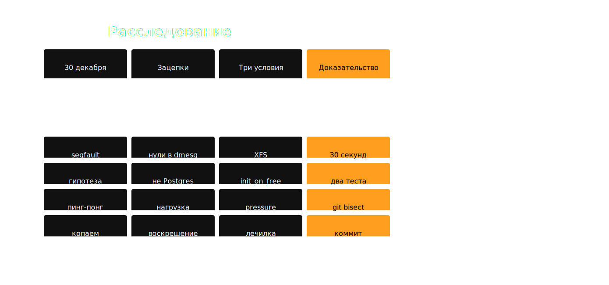

<!--
Воспроизведение за 30 секунд, два теста, git bisect нашёл коммит. Доказательство собрано. Теперь — что внутри этого коммита.
-->

---

<!-- ====== РАЗДЕЛ 8. Root cause (5 мин) ====== -->

# Крошечный diff — два года боли

- **Автор:** Matthew Wilcox, Oracle
- **Коммит:** `mm/readahead: Switch to page_cache_ra_order`
- **Масштаб:** 3 файла, +5 / −5 строк



<!--
Автор коммита — Matthew Wilcox из Oracle. Коммит называется «mm/readahead: Switch to page_cache_ra_order». Звучит безобидно, правда? Три файла изменены, плюс пять строк, минус пять строк. Крошечный diff — и два года боли для серверов с XFS по всему миру.
Что он сделал? Он поменял способ, которым ядро подгружает страницы файлов в память. Всего несколько строчек. Но эти строчки изменили порядок, в котором ядро работает со структурами управления памятью. И в этом новом порядке появилось окно — маленькая щель, через которую мог пролезть баг.
-->

---

# Race condition: два CPU, одна структура

<!--
А дальше — race condition. Гонка данных. Вот тут я покажу на слайде картинку, потому что это ключевой момент всей истории.
Представьте два процессора, которые одновременно работают с памятью. Это нормальная ситуация для любого сервера.
-->

---

<!-- Race condition: progressive reveal — 4 слайда -->

# CPU1 берёт страницу в свой список, отпускает lock



<!--
CPU номер один занимается дефрагментацией памяти. Он берёт структуру данных из общей очереди, перемещает к себе в локальный список и начинает с ней работать. Блокировку на общую очередь он при этом уже отпустил.
-->

---

# CPU2 берёт lock, хочет удалить ту же страницу



<!--
CPU номер два в это же время освобождает ту же самую структуру данных. Он берёт блокировку на общую очередь и удаляет элемент из неё.
-->

---

# Страницы нет в очереди — она у CPU1!



<!--
Но элемент-то уже не в очереди — блин, он в локальном списке первого CPU! И когда второй процессор дёргает указатели, он ломает локальный список первого. Это как если бы два человека одновременно разбирали цепочку звеньев — один с одного конца, другой с другого — и в какой-то момент цепочка рвётся.
-->

---

# Указатели сломаны → Bad page → Сегфолт



<!--
Результат: повреждённые структуры памяти, «Bad page state», ядро в панике. А внешне — непредсказуемый сегфолт в любом приложении.
Это классический race condition. Два потока, общие данные, нет согласованности в нужном месте. И стреляет он только под нагрузкой, когда оба CPU параллельно лезут в одни и те же структуры. Без нагрузки они просто не пересекаются, и гонка не возникает. Вот почему это «системный баг под нагрузкой».
-->

---

# Починили случайно. Тот же автор, через 2 года.

- 18 патчей: связный список → массив
- С массивом **гонка не возникает**
- **Не знал**, что чинит этот баг
- **Бэкпорта нет**: никто не связал два факта

<!--
Починили это в районе ядра 6.9. И вот что самое поразительное — починили случайно. Тот же самый Matthew Wilcox через два года выпускает серию из восемнадцати патчей, где переделывает работу с памятью. Суть: заменить связный список на массив. При работе с массивом гонка не возникает. Но он не знал, что чинит именно этот баг — он просто оптимизировал подсистему. Официального бэкпорта в старые ядра до сих пор нет, потому что никто в upstream не связал эти два факта.
Нашли эту гонку, кстати, не мы одни. Инженер из ARM поймал её на 70-ядерном сервере при тестировании подсистемы памяти. Классика — нагрузка, многоядерность, параллелизм.
-->

---

# Red Hat **перепрыгнул** проблемный диапазон

- RHEL 9: ядро **5.14** — до бага
- RHEL 10: ядро **6.12** — после фикса


<!--
И вот ещё интересный факт, который нам в комментариях на Хабре подсказали. Red Hat как-то удачно перепрыгнул проблемный диапазон ядер. В RHEL 9 у них ядро 5.14 — до бага. В RHEL 10 — 6.12, после фикса. Как будто они что-то знали, чего не знали другие. Включая, кстати, российские компании, распространяющие Linux. Мы этот факт заметили и долго улыбались.
-->

---

# Один сломал, другой починил. **Не видя бага**

<!--
Вот такой вот open source. Один человек сломал, другой человек починил. Через два года. И оба коммита — от разработчика из Oracle. Баг, о котором никто не знает, но который уже исправлен. Никто не репортил, что это нужно чинить — поэтому никто и не понял, что починил.
-->

---

# Полсекунды, которые спасли мир

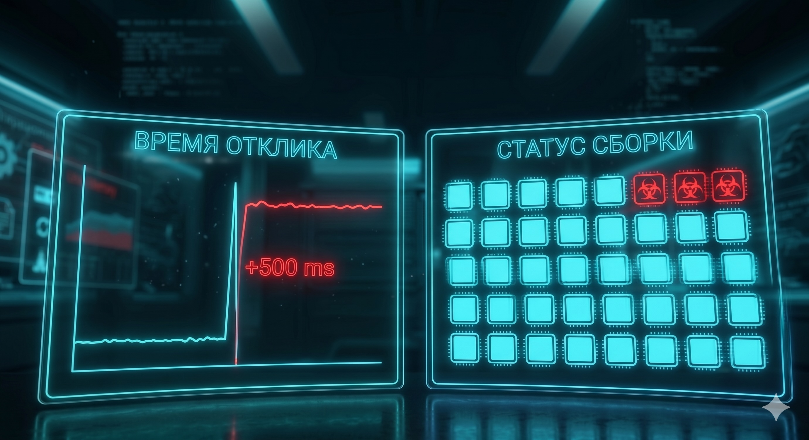

<!--
И знаете, это ведь не уникальная ситуация. Вспомните историю с XZ Utils в 2024 году. Андрес Фройнд, инженер из Microsoft, занимался совершенно рутинной работой — оптимизировал производительность PostgreSQL. И заметил, что SSH-логин стал на полсекунды медленнее, чем обычно. Полсекунды. Любой другой списал бы на погрешность. Но Андрес решил покопать — и обнаружил бэкдор в библиотеке сжатия XZ Utils, через который можно было получить полный доступ к любому Linux-серверу по SSH. Бэкдор, который два года внедрял человек под псевдонимом, аккуратно вкрадываясь в доверие мейнтейнера. Заражённая версия уже попала в тестовые репозитории Debian и Fedora — до стабильных релизов оставались считанные недели. Если бы не эти полсекунды и не занудство одного инженера, бэкдор разъехался бы по серверам компаний по всему миру. И мы бы узнали об этом, скорее всего, уже после того, как им воспользовались.
-->

---

# Мир спасли случайно. Дважды.

<!--
Вот что общего у этих двух историй. И у Wilcox с нашим багом, и у Фройнда с XZ — мир спасли случайно. Не потому что кто-то целенаправленно искал. А потому что инженер заметил аномалию и не поленился разобраться. В одном случае — нули вместо кода. В другом — лишние полсекунды. Мелочь, которая оказалась не мелочью.
-->

---

<!-- Навигация: root cause найден -->

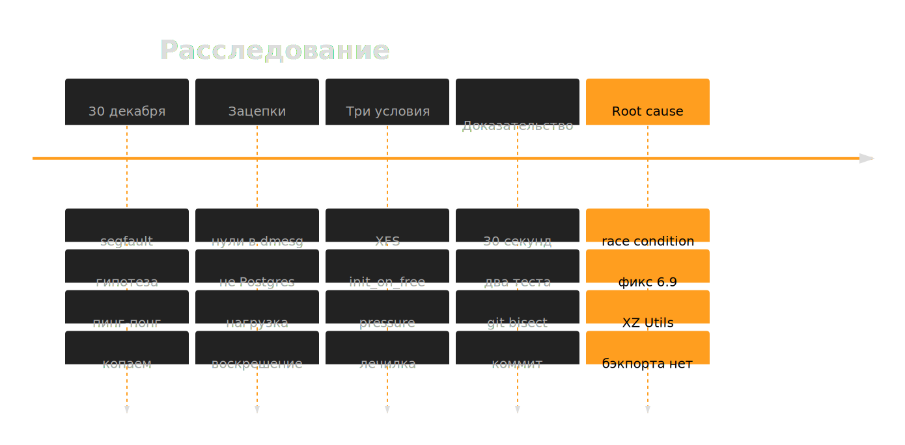

<!--
Мы добрались до root cause. Race condition, случайный фикс, бэкпорта нет. Вот весь путь расследования — от 30 декабря до финала. Теперь — выводы.
-->

---

<!-- ====== РАЗДЕЛ 9. Выводы (4 мин) ====== -->

# Набор инструментов расследования

<!--
Ну хорошо, историю рассказали. Даже две. Теперь давайте к практике. Что из этого можно вынести? Я выделил три вещи.
Первое — набор инструментов. Вы его только что видели в действии, давайте соберём.
Мы нашли причину потому, что заглянули в dmesg — системный журнал. Если бы остались в логах Postgres — ходили бы кругами. Потом нашли паттерн — нули. У вас это может быть время суток, тип нагрузки, версия ОС. Но без паттерна — тыкаешь вслепую. Дальше — метод исключения: железо? нет. Postgres? нет, другие тоже падают. ОС? теплее. Уровень за уровнем. Потом сжали воспроизведение с раза в неделю до тридцати секунд — и это открыло нам git bisect: полтора десятка проверок вместо тысяч, работает в любом git-проекте.
-->

---

# Любой чёрный ящик можно сделать белым


<!--
И последнее, может быть, самое важное: ломать стеночки в голове. У нас у всех есть эти стеночки — «это не мой уровень», «тут нужен другой специалист». Но любой чёрный ящик можно сделать белым, если подойти к нему инженерными методами. Мы — разработчики СУБД. Ядро Linux — не наша специализация. Но мы туда пошли. И разобрались.
-->

---

# Проверьте свои серверы

- Ядро **5.18 — 6.8** + **XFS** + **init_on_free** = обратитесь к вендору ОС
- Фикс в **6.9**, но **не помечен** как исправление
- **Бэкпорта нет**: на LTS-ядрах фикс сам не придёт

<!--
Второе — что делать прямо сейчас. Если у вас Linux-серверы — проверьте три вещи. Ядро от 5.18 до 6.8? Файловая система XFS? Параметр init_on_free включён? Если три из трёх — обратитесь к поставщику вашей ОС.
И вот тут есть неприятный нюанс. Фикс живёт в ядре 6.9, но он не помечен как исправление этого бага. Никто в upstream не связал патч с проблемой. А значит — бэкпорта в старые ядра нет. Если вы сидите на LTS-ядре вроде 5.15 или 6.1 — фикс к вам сам не придёт. Ваш вендор может просто не знать, что это нужно перенести. Вот это ловушка: баг уже исправлен в будущем, но в вашем настоящем он продолжает работать.
Что можно сделать? Обратиться к вендору ОС — возможно, конкретно в вашем ядре это уже починили. Если нет — как вариант, мигрировать на ext4 или указать init_on_free=0 в аргументах загрузки. Но на свой страх и риск — не забывайте, что init_on_free включают по требованиям безопасности. Тут нужен баланс.
И не делайте резких, необдуманных действий. Главное — не бежать обновлять прод сгоряча.
-->

---

# 6 человек. Без любого — не дошли бы

<!--
Третье — и самое главное — командная работа. Эту задачу решал не я один, а шесть человек. И если бы хоть одного из них не было в этой цепочке — мы бы до финала не дошли. Причём никто из нас не эксперт по ядру Linux. У каждого свои знания, своё видение. Иногда человек говорит нужные слова — и вместе вы можете скреативить гораздо больше, чем в одиночку.
-->

---

# Профессиональное любопытство — самый мощный инструмент

<!--
Помните, в начале мы отправили отчёт: «не наш баг»? И формально были правы. Но мы пошли до конца — потому что клиентам не легче от того, что баг «не наш». И потому что профессиональное любопытство — это, пожалуй, самый мощный инструмент инженера.
-->

---

<!-- ====== РАЗДЕЛ 10. Финал (1 мин) ====== -->

# Стеночки в голове можно ломать

<!--
Вот такая вот история. Знаете, что мне больше всего запомнилось из этого года? Не конкретный коммит, не race condition. А то, как мы раз за разом упирались в стеночки в голове — «всё, здесь твоя специализация закончилась, дальше ты ничего не можешь, парень». А потом приходили свежие силы, появлялись новые идеи, иногда совсем тривиальные. И думаешь: блин, почему я об этом не подумал в январе?
-->

---

# Любопытство и люди рядом, которым не всё равно

<!--
Баги без причин не бывают. Причина есть всегда. Просто иногда она прячется глубже, чем мы привыкли смотреть. И чтобы до неё добраться, нужны две вещи: любопытство и люди рядом, которым не всё равно.
-->

---

# `Code: 00 00 00 00 00 00`

## Теперь вы знаете, откуда они и что с ними делать.

<!--
Помните те нули из самого начала? Code: 00 00 00 00 00 00. Теперь вы знаете, откуда они взялись и что с ними делать.
-->

---

<!-- _class: lead -->
<!-- _paginate: false -->

# Спасибо!

## habr.com/ru/companies/postgrespro/articles/980218/

### Михаил Жилин, Postgres Professional

<!--
Спасибо! Статья с деталями и тестовыми скриптами — на Хабре, ссылочка на слайде. Давайте вопросы.
-->
