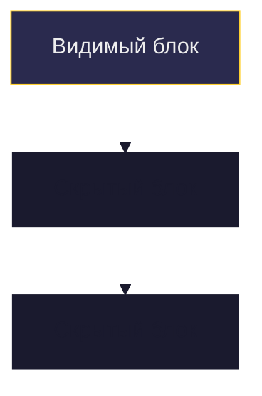
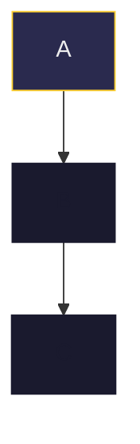

# Постепенное раскрытие Mermaid-диаграмм на слайдах

## Подход: "всё нарисовано, но скрыто цветом"

Все слайды серии содержат ОДИНАКОВУЮ структуру диаграммы (все блоки, все стрелки).
На каждом шаге "проявляются" новые элементы за счёт смены цвета с прозрачного на видимый.

### Как работает

Фон слайда: `#1a1a2e` (тёмно-синий).

| classDef | Назначение | fill | stroke | color | linkStyle |
|----------|-----------|------|--------|-------|-----------|
| **done** | Уже обсудили | `#2a2a4e` | `#FFD02F` | `#eee` | `stroke:#FFD02F,stroke-width:2px` |
| **active** | Сейчас обсуждаем | `#3a2a1e` | `#FFD02F` | `#FFD02F` | `stroke:#FFD02F,stroke-width:3px` |
| **pending** | Ещё не дошли | `#1e1e30` | `#444` | `#666` | `stroke:#444,stroke-width:1px` |
| **error** | Проблема/сбой | `#4e2a2a` | `#ff4444` | `#eee` | `stroke:#ff4444,stroke-width:2px` |
| **success** | Успех/решение | `#2a4e2a` | `#44ff88` | `#eee` | `stroke:#44ff88,stroke-width:2px` |

### Поддержка по типам диаграмм

| Тип | style блоков | linkStyle стрелок | Вердикт |
|-----|-------------|-------------------|---------|
| **flowchart** | `style A fill:...,stroke:...,color:...` | `linkStyle 0 stroke:...,stroke-width:...` | ПОЛНАЯ поддержка |
| **sequenceDiagram** | Только глобальные CSS | Нет индивидуальных стилей | НЕ подходит |

### Вывод: flowchart для диафильмов, не sequence diagram

Sequence diagram в Mermaid не поддерживает индивидуальную стилизацию элементов.
Flowchart поддерживает `style` для каждого узла и `linkStyle` для каждой связи.

**Решение:** Перерисовать все диаграммы как flowchart (сверху вниз, TB) вместо sequence diagram. Flowchart может изображать последовательность событий через направленные стрелки.

### Паттерн для серии слайдов



```mermaid
%% Шаг 2 из 3: видны A и B
    style A fill:#2a2a4e,stroke:#FFD02F,color:#eee
    style B fill:#2a2a4e,stroke:#FFD02F,color:#eee
    style C fill:#1a1a2e,stroke:#1a1a2e,color:#1a1a2e
    linkStyle 0 stroke:#FFD02F,stroke-width:2px
    linkStyle 1 stroke:#1a1a2e,stroke-width:0px
```

### CSS-переменные для удобства

Для читаемости файлов используем classDef:



Но linkStyle всё равно нужно задавать по индексу — classDef для связей не работает.
